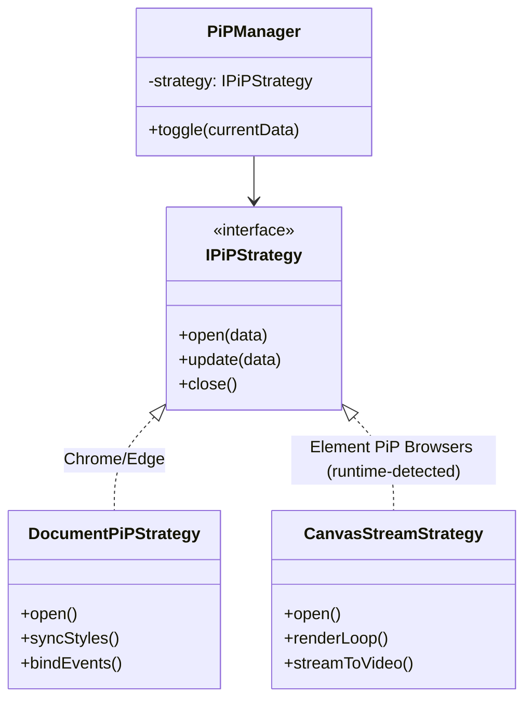

# Technical Design Document: Aura-Timer Hybrid PiP Architecture

**Project:** Aura-Timer  
**Version:** 2.0.0  
**Status:** Approved for Implementation  
**Author:** Gemini (AI Assistant)  
**Date:** 2025-11-30

-----

## 1\. 概述 (Executive Summary)

本设计旨在为 Aura-Timer 引入跨浏览器的“画中画 (Picture-in-Picture, PiP)”功能。鉴于浏览器对 PiP 标准支持的分裂现状，本方案定义了一种**混合架构 (Hybrid Architecture)**：

1.  **Chromium 内核 (Chrome/Edge):** 使用 `Document Picture-in-Picture API`，提供可交互的 DOM 悬浮窗。
2.  **支持元素 PiP 的浏览器 (Chrome/Safari 等):** 使用 `HTMLVideoElement` + Canvas 实时流，提供只读的视觉悬浮窗。
3.  **Firefox:** 使用同一套 Canvas 绘制逻辑，在主界面中渲染为可见 `<video>`，由 Firefox 自带的 PiP 按钮开启画中画（**不使用 Web PiP JS API**）。

-----

## 2\. 架构设计原则 (Architectural Principles)

  * **渐进式增强 (Progressive Enhancement):** 优先检测高级 API，向下兼容基础功能。
  * **策略模式 (Strategy Pattern):** 定义统一的 `PiPProvider` 接口，根据环境动态注入 `DocumentPiPStrategy` 或 `CanvasStreamStrategy`。
  * **关注点分离 (SoC):** PiP 逻辑与核心计时器状态 (Timer State) 解耦，仅通过信号/回调通信。
  * **高性能 (High Performance):** 严格控制渲染循环帧率，防止后台高 CPU 占用及电池损耗。

-----

## 3\. 详细方案设计 (Detailed Design)

### 3.1 核心类图逻辑

系统由一个管理器 (`PiPManager`) 和两个具体策略实现类组成。



### 3.2 策略 A: Document PiP (针对 Chrome 111+)

利用原生 DOM 窗口能力，允许用户在悬浮窗内点击按钮（如暂停、重置）。

  * **技术栈:** `window.documentPictureInPicture`
  * **关键实现:**
      * **样式同步:** 必须遍历主窗口的 `document.styleSheets` 并克隆到 PiP 窗口，否则悬浮窗将无样式。
      * **事件代理:** PiP 窗口内的点击事件需调用主应用的回调函数（React Portal 可自动处理此上下文，原生 JS 需手动绑定）。

### 3.3 策略 B: Canvas Stream Adapter (针对支持元素 PiP 的浏览器)

利用 Canvas 绘图生成媒体流，通过 `HTMLVideoElement.requestPictureInPicture()` 在支持该 API 的浏览器中开启 PiP。当前目标是**所有在运行时检测到实现了元素 PiP API 的浏览器（以特性检测为准，而不是特定厂商名称）**。  

对于 Firefox，本项目仅复用同一套 Canvas 绘制逻辑，在主界面中渲染为一个可见 `<video>` 元素，由 Firefox 自带的 PiP 按钮启动画中画，而不是通过 Web API 直接调用。

  * **技术栈:** `HTMLCanvasElement.captureStream()`, `HTMLVideoElement`
  * **性能规范:**
      * **帧率节流 (Throttling):** 计时器文本仅需 1 FPS - 10 FPS。严禁使用默认的 60 FPS 刷新率。
      * **Alpha 通道关闭:** `canvas.getContext('2d', { alpha: false })`，减少 GPU 合成开销。
      * **资源释放:** 关闭 PiP 时必须立即执行 `stream.getTracks().forEach(t => t.stop())`，防止内存泄漏。

-----

## 4\. 核心代码实现参考 (Core Implementation)

### 4.1 PiP Manager (入口：Web PiP 支持的浏览器)

```javascript
export class PiPManager {
  constructor() {
    this.strategy = null;
  }

  getBestStrategy() {
    if ('documentPictureInPicture' in window) {
      // Document PiP - Chrome/Edge
      return new DocumentPiPStrategy();
    } else if (document.pictureInPictureEnabled) {
      // Element PiP - Chrome/Safari 等支持 HTMLVideoElement.requestPictureInPicture 的浏览器
      return new CanvasStreamStrategy();
    }
    throw new Error('PiP not supported by Web API');
  }

  async toggle(timerState, callbacks) {
    if (this.strategy && this.strategy.isActive) {
      this.strategy.close();
      this.strategy = null;
      return;
    }

    this.strategy = this.getBestStrategy();
    await this.strategy.open(timerState, callbacks);
  }

  update(timerState) {
    if (this.strategy && this.strategy.isActive) {
      this.strategy.update(timerState);
    }
  }
}
```

### 4.2 Canvas Strategy (元素 PiP 优化版)

```javascript
class CanvasStreamStrategy {
  constructor() {
    this.isActive = false;
    this.canvas = document.createElement('canvas');
    this.ctx = this.canvas.getContext('2d', { alpha: false }); // 性能优化
    this.video = document.createElement('video');
    this.fps = 10; // 限制帧率
    this._rafId = null;
    this._lastDraw = 0;
  }

  async open(initialState) {
    this.isActive = true;
    this.initVideoElement();
    this.canvas.width = 600; 
    this.canvas.height = 340;
    
    // 启动渲染循环
    this.startRenderLoop(initialState);
    
    // 建立流
    const stream = this.canvas.captureStream(this.fps);
    this.video.srcObject = stream;
    
    try {
      await this.video.play();
      await this.video.requestPictureInPicture(); // 仅在支持元素 PiP 的浏览器中可用
    } catch (e) {
      console.error("Firefox PiP launch failed:", e);
      this.close();
    }
  }

  initVideoElement() {
    this.video.muted = true;
    this.video.autoplay = true;
    this.video.style.height = '0'; // 隐藏但保留在 DOM
    document.body.appendChild(this.video);
    
    // 监听关闭事件 (用户点击 X)
    this.video.addEventListener('leavepictureinpicture', () => this.close());
  }

  update(newState) {
    this.currentState = newState;
    // 状态更新时不立即重绘，由 Loop 统一接管以保持帧率稳定
  }

  startRenderLoop() {
    const loop = (timestamp) => {
      if (!this.isActive) return;
      
      const interval = 1000 / this.fps;
      if (timestamp - this._lastDraw >= interval) {
        this.draw(this.currentState);
        this._lastDraw = timestamp;
      }
      this._rafId = requestAnimationFrame(loop);
    };
    requestAnimationFrame(loop);
  }

  draw(state) {
    if (!state) return;
    // 绘图逻辑：背景清空 -> 绘制文字
    this.ctx.fillStyle = '#000000';
    this.ctx.fillRect(0, 0, this.canvas.width, this.canvas.height);
    this.ctx.fillStyle = '#ffffff';
    this.ctx.font = 'bold 80px monospace';
    this.ctx.textAlign = 'center';
    this.ctx.textBaseline = 'middle';
    this.ctx.fillText(state.timeString, this.canvas.width/2, this.canvas.height/2);
  }

  close() {
    this.isActive = false;
    if (this._rafId) cancelAnimationFrame(this._rafId);
    
    // 关键：停止媒体流轨道，释放硬件资源
    if (this.video.srcObject) {
      this.video.srcObject.getTracks().forEach(track => track.stop());
      this.video.srcObject = null;
    }
    
    if (document.pictureInPictureElement === this.video) {
      document.exitPictureInPicture().catch(() => {});
    }
    
    this.video.remove();
  }
}
```

-----

## 5\. 最佳实践与注意事项 (Best Practices)

### 5.1 后台标签页冻结 (Background Tab Discarding)

**问题:** 当用户最小化浏览器主窗口只留 PiP 时，浏览器会为了省电停止 `requestAnimationFrame`。  
**解决方案（当前实现）:**

1.  使用基于时间戳的高精度计时器（见 `docs/timer-precision.md`），即使后台帧率降低也能恢复到正确时间。
2.  在使用 Web PiP 的浏览器中，通过循环播放一段**静音音频**，将标签页标记为 "Audio Playing"，减少后台冻结概率。  
    Firefox 路径不依赖 Web PiP，而是通过可见 `<video>` + 浏览器内建 PiP 按钮，仍可受益于音频保持激活。

### 5.2 错误处理

  * **User Activation:** 对于通过 `requestPictureInPicture()` 启动的浏览器，需要确保调用发生在用户手势事件处理函数内（如 `click` 事件），否则可能被视为非用户触发而被拦截。当前 Firefox 路径不再使用该 API，而是依赖浏览器自带 PiP UI。

### 5.3 关闭回调与 PiP 窗口管理（实现约定）

为保证行为一致性和可维护性，当前实现在关闭语义上约定如下：

- **关闭回调统一由策略层触发：**  
  `PiPManager` 不再直接调用 `callbacks.onClose()`，而是交由 `DocumentPiPStrategy` / `CanvasStreamStrategy` 在各自的 `close` / `cleanup` 中触发。这保证了每个 PiP 会话的关闭只通知一次，避免「Manager + Strategy」双重回调。

- **Document PiP：幂等清理与事件绑定：**  
  `DocumentPictureInPicture.requestWindow()` 返回的 `Window` 在策略内部持有并渲染 DOM。通过 `pagehide` 事件触发一次性 `cleanup`，内部包含幂等检查（重复调用不会再次触发回调或操作 DOM）。

- **Canvas PiP：使用返回值绑定 PictureInPictureWindow：**  
  `HTMLVideoElement.requestPictureInPicture()` 的返回值 `PictureInPictureWindow` 用于绑定 `resize` 事件，而不是依赖 `enterpictureinpicture` 事件时间顺序。`close()` 中负责停止 `requestAnimationFrame` 循环、停止 `MediaStreamTrack`、退出 PiP，并在最后触发一次 `callbacks.onClose()`。

-----

## 6\. 权威参考 (References)

1.  **W3C Document Picture-in-Picture API (Draft):**
      * [https://wicg.github.io/document-picture-in-picture/](https://wicg.github.io/document-picture-in-picture/)
2.  **W3C Picture-in-Picture (Video) API:**
      * [https://w3c.github.io/picture-in-picture/](https://w3c.github.io/picture-in-picture/)
3.  **MDN Web Docs - HTMLCanvasElement.captureStream:**
      * [https://developer.mozilla.org/en-US/docs/Web/API/HTMLCanvasElement/captureStream](https://developer.mozilla.org/en-US/docs/Web/API/HTMLCanvasElement/captureStream)
4.  **Google Chrome Developers - Document PiP Guide:**
      * [https://developer.chrome.com/docs/web-platform/document-picture-in-picture/](https://developer.chrome.com/docs/web-platform/document-picture-in-picture/)
